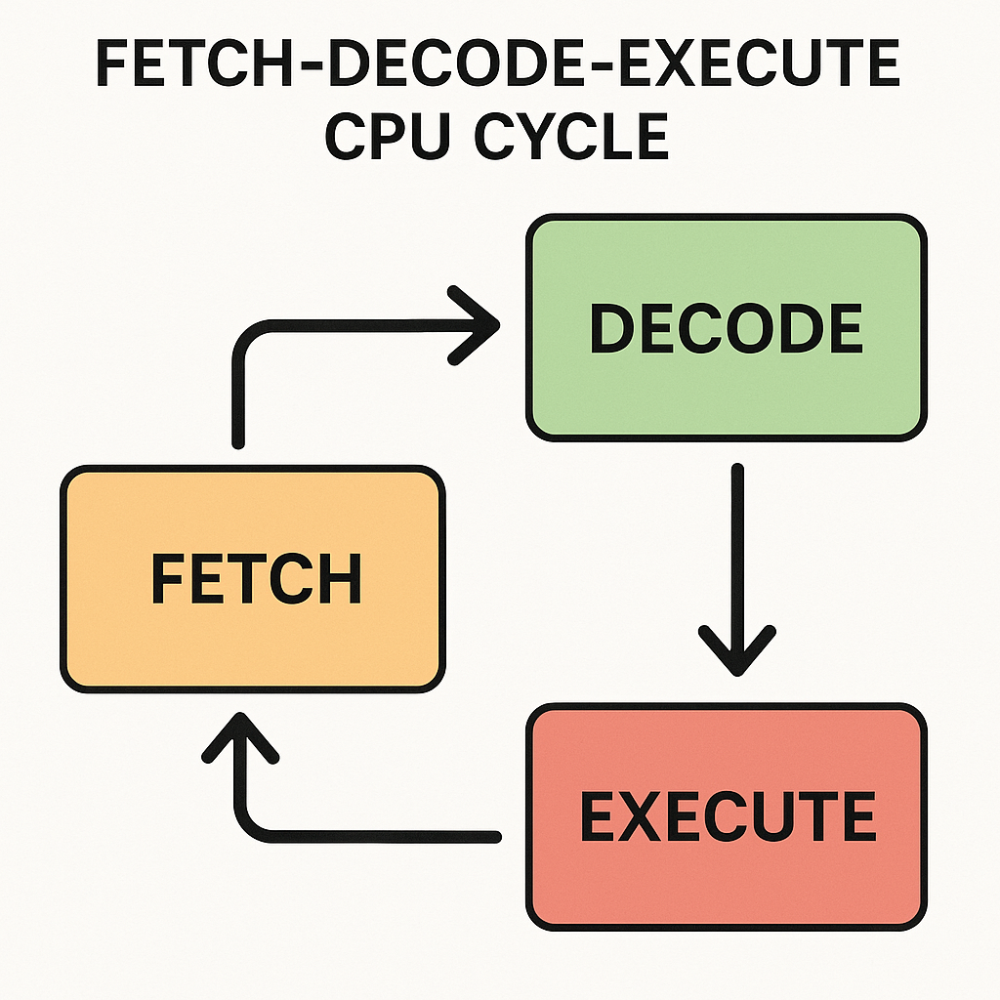

# Central Processing Unit (CPU)

> **Random Quote** At the heart of every computer is a tiny control freak, obsessed with order, timing, and doing one thing at a time, very, very fast.

The **CPU (Central Processing Unit)** is the component of the computer responsible for executing programs. It continuously reads instructions, decodes their meaning, and performs the required operations at extremely high speeds.

**Contents:**

* [The Fetch, Decode, Execute Cycle](#the-fetch-decode-execute-cycle)
* [Boot Sequence](#boot-sequence)
* [Processor Modes](#processor-modes)

---

## The Fetch, Decode, Execute Cycle

Also known as the **instruction cycle**, this is the repeating three-step process the CPU uses to fetch and execute instructions from memory. It runs continuously until the system is shut down.

The three main phases of the cycle are:

* **Fetch:** Retrieve the next instruction from memory.
* **Decode:** Determine what the instruction means.
* **Execute:** Perform the required operation.

**Fetch:** The **Instruction Pointer (IP / EIP / RIP)** holds the memory address of the next instruction. The CPU fetches the instruction from that address and loads it into the **Instruction Register (IR)**. It then increments the instruction pointer, unless the instruction specifies otherwise (as in the case of jumps or calls).

**Decode:** The *Control Unit* interprets the operation code of the instruction. It identifies the operation (e.g., `ADD`, `MOV`), the involved registers or memory addresses, and the type of data being processed.

**Execute:** The CPU activates the appropriate hardware components, such as the Arithmetic Logic Unit (ALU) for calculations, memory access units for load/store operations, or control lines for jumps or system instructions, and executes the instruction. This may result in changes to registers, flags, or memory.

After execution, the cycle repeats.

**Fun fact:** This process can occur **billions of times per second**.

> In operating system development, you will eventually write code that modifies the instruction pointer and manages memory, essential skills for tasks like context switching and trap handling.

---

## Boot Sequence

When a computer is powered on, the CPU does not immediately start executing your operating system. Instead, it begins with a series of predefined steps known as the **boot sequence**:

`Power-on → BIOS/UEFI → Bootloader → Kernel`

* **Power-on:** When the power button is pressed, the motherboard supplies power to the CPU and other components. The CPU resets and begins execution from a fixed memory address. On x86 systems, this is typically `0xFFFFFFF0`, the top of the 32-bit address space.
* **BIOS/UEFI:** *BIOS (Basic Input/Output System)* or UEFI (its modern replacement) is firmware stored on the motherboard. It initializes the hardware (CPU, RAM, keyboard, video, etc.) and searches for a bootable device (HDD, SSD, USB). It then loads the bootloader into memory. In BIOS systems, the bootloader resides in the **MBR (Master Boot Record)**, the first 512 bytes of the disk.
* **Bootloader:** The bootloader (e.g., GRUB) loads the operating system kernel into memory and transfers control to it. It also switches the CPU to protected mode (in 32-bit systems) or long mode (in 64-bit systems), depending on the target architecture.
* **Kernel:** The kernel performs all subsequent tasks, setting up memory management, initializing interrupts, mounting the root filesystem, launching the first user-space process, and more.

---

## Processor Modes

CPU modes define how the processor operates: what memory it can access, which instructions it can execute, and its level of privilege. Think of modes as different gears in a manual car, each suited to a specific task.

Here are the primary CPU modes:

1. [Real Mode](#real-mode)
2. [Protected Mode](#protected-mode)
3. [Long Mode](#long-mode)
4. [Virtual 8086 Mode](#virtual-8086-mode)
5. [System Management Mode](#system-management-mode)

---

### Real Mode

This is the original operating mode of the Intel 8086 CPU. It is the mode the CPU starts in upon power-up. Your bootloader will initially run in real mode, so it’s important to understand its limitations.

**Key Characteristics:**

* 16-bit registers and instructions
* Limited to 1 MB of memory access
* No memory protection or multitasking
* No privilege levels
* Direct access to hardware and BIOS interrupts

Used by: BIOS and first-stage bootloaders

---

### Protected Mode

Introduced with the Intel 80286, protected mode adds key features for multitasking and memory safety.

**Key Characteristics:**

* 32-bit registers and instructions
* Up to 4 GB of addressable memory
* Virtual memory support through paging
* Four privilege levels (rings 0–3)
* Memory segmentation using the Global Descriptor Table (GDT)
* Hardware-enforced isolation between user and kernel space

Used by: 32-bit operating systems (e.g., Windows XP, early Linux distributions)

---

### Long Mode

Introduced with the AMD64 architecture, long mode is the 64-bit operational mode used by modern operating systems.

**Key Characteristics:**

* 64-bit registers
* Support for enormous memory capacities (theoretically up to 16 exabytes)
* Paging-based memory management
* Compatible with both 64-bit and 32-bit applications
* Same privilege level system as protected mode

Used by: Modern 64-bit OSes like Windows 11 and Linux

> **Note:** All x86 CPUs start in real mode. Even on 64-bit systems, the CPU boots into real mode and transitions through protected mode before entering long mode.

---

### Virtual 8086 Mode

This is a special sub-mode within protected mode that allows the execution of real-mode programs in a controlled environment. It was introduced with the 80386 CPU.

**Key Characteristics:**

* Runs 16-bit code in protected mode
* Commonly used by DOS emulators and virtual machines
* Often found in bootloaders and legacy support layers

You will likely not need this mode unless supporting real-mode programs from a protected environment.

---

### System Management Mode (SMM)

A hidden and highly privileged mode used by firmware for tasks like power management and hardware-level control.

**Key Characteristics:**

* Triggered by a **System Management Interrupt (SMI)**
* Executes code in a reserved memory region called **SMRAM**
* Inaccessible to the OS, including ring 0
* Used primarily by BIOS/UEFI and sometimes exploited by rootkits

You typically will not use this mode in OS development unless you venture into advanced firmware programming or hardware security research.
